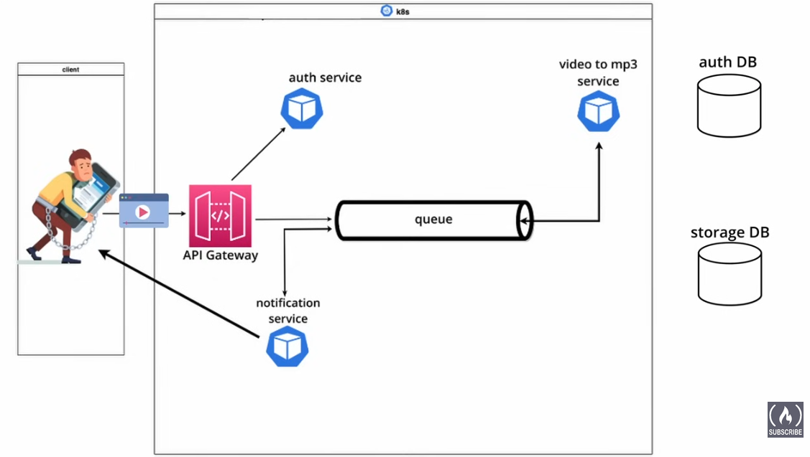

Link al video -> https://www.youtube.com/watch?v=hmkF77F9TLw
Timestamp -> 00:00:00
Canale -> freeCodeCamp.org
REPO VIDEO-> .

## Introduzione

Un'**architettura a microservizi** è un'applicazione sviluppata come un insieme di servizi indipendenti, che possono essere realizzati combinando diverse tecnologie all'interno di un'unica soluzione.

Le tecnologie che verranno utilizzate sono **Python**, **Docker**, **Kubernetes**, **MySQL**, **MongoDB** e **RabbitMQ**.

L'applicazione avrà lo scopo di **convertire file video in file MP3**, e verrà analizzata con un approccio *top-down*.

## Funzionamento dell'applicazione

Quando l’utente caricherà un video, esso passerà attraverso il **Gateway**.  
Il video verrà quindi salvato su **MongoDB** e, contemporaneamente, verrà inserito un messaggio nella **queue** di **RabbitMQ** per notificare ai *Downstream Services* che è disponibile un nuovo video da convertire.

Il **servizio di conversione** (da video a MP3) leggerà il messaggio dalla coda, estrarrà l’**ID del video**, recupererà il file corrispondente da MongoDB, lo convertirà in formato MP3 e invierà un nuovo messaggio al **sistema di notifiche**.  
Quest’ultimo avviserà il client che il file MP3 del video è pronto per il download.

Infine, l’utente potrà utilizzare l’**ID univoco** ricevuto nella notifica per inviare una richiesta all’**API Gateway** e scaricare il file MP3.

Ecco come potresti aggiungere la nuova sezione, mantenendo lo stile coerente con il resto del testo:

## Tecnologie utilizzate

Di seguito vengono descritti i principali strumenti e tecnologie impiegati nel progetto, sia in termini generali che nel contesto specifico di questa applicazione.

### **Python**

Python è un linguaggio di programmazione versatile e adatto allo sviluppo di applicazioni backend.
Nel progetto, Python viene utilizzato per implementare i vari **microservizi** (ad esempio, il servizio di upload, quello di conversione e quello di notifica), grazie alle sue librerie che semplificano la gestione di file, API REST e comunicazioni tra servizi.

### **Docker**

Docker è una piattaforma che consente di creare, distribuire ed eseguire applicazioni in **container**, ovvero ambienti isolati che includono tutto il necessario per l’esecuzione del software.
In questo progetto, ogni microservizio (Gateway, Conversione, Notifica, ecc.) viene eseguito all’interno di un container Docker, garantendo **portabilità**, **scalabilità** e facilità di distribuzione.

### **Kubernetes**

Kubernetes è un sistema di **orchestrazione dei container**, utilizzato per gestire e coordinare più container Docker in ambienti complessi.
Nel progetto viene utilizzato per **automatizzare il deploy**, la **scalabilità** e la **gestione** dei microservizi, assicurando che l’applicazione rimanga disponibile e bilanciata anche in caso di carichi elevati o errori di singoli componenti.

### **MySQL**

MySQL è un **database relazionale** che gestisce dati strutturati tramite tabelle e relazioni.
Nel progetto può essere utilizzato, ad esempio, per memorizzare informazioni relative agli utenti, alle sessioni o ai metadati dei file convertiti, permettendo un accesso rapido e organizzato alle informazioni.

### **MongoDB**

MongoDB è un **database NoSQL** orientato ai documenti, ideale per memorizzare dati non strutturati come file multimediali.
Nel progetto viene utilizzato per **salvare i video caricati** dagli utenti e i **file MP3 generati** dopo la conversione. La sua flessibilità lo rende adatto a gestire grandi quantità di dati binari in modo efficiente.

### **RabbitMQ**

RabbitMQ è un **message broker**, ossia un sistema che gestisce lo scambio di messaggi tra diversi servizi tramite **code (queues)**.
Nel progetto viene utilizzato per **coordinare i microservizi**, permettendo che il servizio di conversione riceva un messaggio ogni volta che un nuovo video è stato caricato, e che il sistema di notifica venga informato quando la conversione è terminata.

---
