Link al video -> https://www.youtube.com/watch?v=pg19Z8LL06w
Canale -> TechWorld with Nana
REPO -> https://gitlab.com/nanuchi/docker-in-1-hour

[Riassunto Comandi Docker](#Riassunto-Comandi-Docker)

## What's Docker?

In parole semplici, **Docker** è una piattaforma di containerizzazione che rende più semplice sviluppare, distribuire ed eseguire applicazioni rispetto alle procedure precedenti alla sua introduzione. Lo fa “impacchettando” le applicazioni in **container**, ciascuno contenente tutto il necessario per funzionare: librerie, dipendenze, configurazioni di runtime e dell’ambiente.

---

## What problems Docker solves in development and deployment process

Prima della sua introduzione, per poter sviluppare un’applicazione lo sviluppatore doveva installare tutto il necessario (database, servizi vari, …) direttamente sulla propria macchina locale. Ad esempio, se sviluppavi un sito in *JavaScript* poteva servirti *PostgreSQL* o *Mosquitto* per la messaggistica, rendendo obbligatoria l’installazione locale di tutti questi componenti. Inoltre, per ogni sistema operativo esistevano procedure e versioni diverse, complicando ulteriormente lo sviluppo.

Con i **container** non è più necessario installare tutti i servizi direttamente sul sistema operativo, perché con **Docker** si ha tutto il necessario in un ambiente isolato. È anche possibile avere più versioni dello stesso servizio in esecuzione sulla propria macchina senza conflitti.

Prima di Docker, il processo di sviluppo di un’applicazione poteva essere riassunto così:

Il team di sviluppo produceva un artefatto (o pacchetto) che descriveva come installare l’applicazione sul server, ad esempio un file *jar* per una app Java, insieme alle istruzioni per installare servizi esterni come un DBMS. Queste informazioni venivano poi passate al team di operations, che si occupava dell’installazione e della configurazione.

Tra i **problemi** di questo approccio c’era la necessità di installare manualmente tutti i componenti sull’OS del server, con possibilità di errori; inoltre, la comunicazione tra i due team poteva causare ulteriori problemi, generando **errori umani**. Con i container questo processo è semplificato perché lo sviluppatore include nel container, oltre al codice sorgente, anche tutte le dipendenze necessarie; essendo tutto isolato, l’unica cosa da installare sul server è il Docker runtime.

L’unica cosa che deve fare il team operativo è eseguire un comando Docker per recuperare ed avviare l’artefatto.

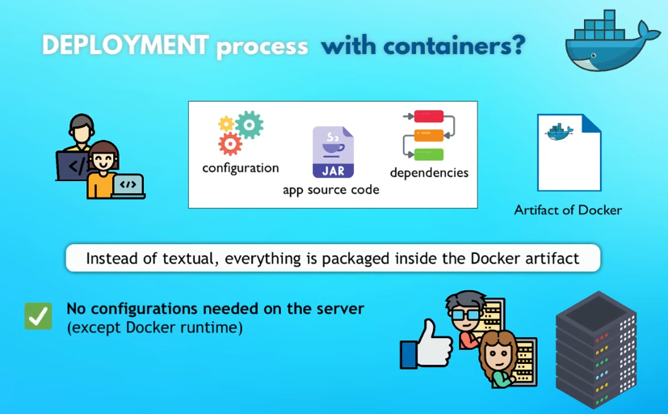

---

## Virtual Machine vs Docker e Install Docker

All'inizio è stato detto che Docker è uno strumento di virtualizzazione come una macchina virtuale eppure ora analizziamo i vantaggi che hanno portato ad un così ampio utilizzo di Docker. `Se con Docker non c'è bisogno di installare i componenti sull'OS come fa ad utilizzarli?`

Per poter rispondere si parte dall'OS. Un sistema operativo è costituito da due livelli principali, il **Kernel** e l'**Applications Layer**. Il primo comunica con l'hardware della macchina ed è quindi dove va installato il sistema operativo mentre il secondo livello comprende tutte le applicazioni che poi vengono utilizzate; in tal modo, il livello del Kernel fa quindi da intermediario tra l'application layer e l'hardware. Sia Docker che la macchina virtuale, come detto, sono strumenti di virtualizzazione ma la differenza sta in **quale parte dell'OS virtualizzano**. 

**Docker virtualizza l'application layer** contenendo le applicazioni e altri servizi e app installati sopra quel livello e utilizza il Kernel dell'host mentre il **la macchina virtuale virtualizza entrambi i livelli** non utilizzando il kernel dell'host ma il proprio.

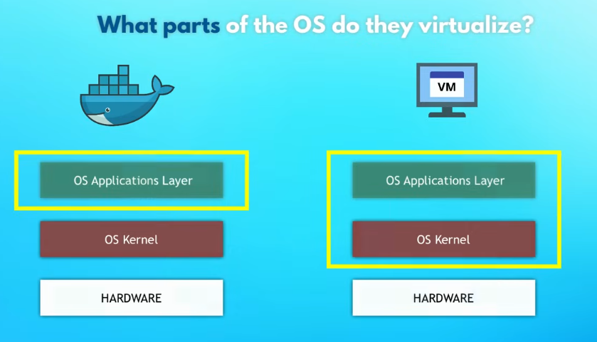

Tale differenza comporta che **i pacchetti o immagini di Docker siano molto più leggeri** perché devono implementare un solo livello del sistema operativo nell'ordine di alcuni *MB* contro alcuni *GB*; comportando anche una **maggiore velocità** nel primo caso rispetto al secondo.

Per quanto riguarda la **compatibilità** si ha un discorso diverso dato che le macchine virtuali sono compatibili con tutti gli OS mentre Docker è compatibile solo con distro Linux. Per funzionare su Windows utilizza WSL2 (*Windows Subsystem for Linux*) virtualizzando una leggera distro Linux su Windows.

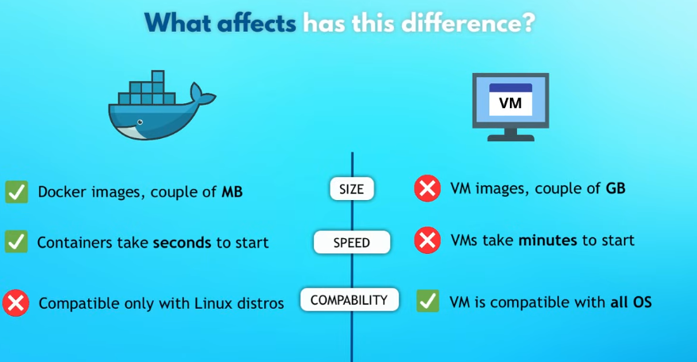

**Docker Desktop** include:

- **Docker Engine**: il cuore di Docker, rende possibile la virtualizzazione gestendo istanze (immagini) e container;

- **Docker CLI - Client**: che è un interfaccia da linea di comando per eseguire i comandi Docker;

- **GUI Client**: ovvero una user frinedly UI

- ...

---

## Docker Images vs Containers

Docker permette di "impacchettare" le applicazioni con il loro environment per poterlo utilizzare e condividere facilmente.

Una **Docker Image** è sostanzialmente un artefatto (prodotto finito) ma con altre informazioni al suo interno oltre a poter modificare e aggiungere file e cartelle in tale immagine.

Un **Dokcer Container** esegue le immagini, è quindi l'elemento che effettivamente avvia l'applicazione.  **Un container è un istanza in esecuzione di un immagine**. 

`Per un immagine si possono avviare diversi container.`

---

## Docker Registries

È chiaro quindi che i container si ottengono eseguendo delle immagini, ma come si ottengono le immagini? È qui che entrano in gioco i **Docker Registries**.

Essi sono servizi che archiviano e distribuiscono le *Docker Images*. Un registry permette di salvare, recuperare e condividere le immagini tra sviluppatori, team o sistemi di deploy. Il più noto è **Docker Hub**, ma esistono anche registry privati o cloud come Amazon ECR, GitHub Container Registry e Google Artifact Registry.

**Immagini ufficiali** sono disponibili nei rispettivi siti di, ad esempio, Mongo e Postgres.

---

## Docker Image Versions

Ovviamente le tecnologie utilizzate variano nel corso del tempo, aggiornandosi; al contempo anche le **Docker Image** si aggiornano cambiando di versione.

Una volta trovata l'immagine che si vuole utilizzare su, Docker Hub ad esempio, si sceglie una versione specifica e si digita il seguente comando da Docker CLI `docker pull nginx:1.23`. Docker hub è la location settata di default per scaricare le immagini. Per poi eseguirla basta digitare `docker run nginx:1.23`. Il comando `docker ps` riferisce i container in esecuzione:

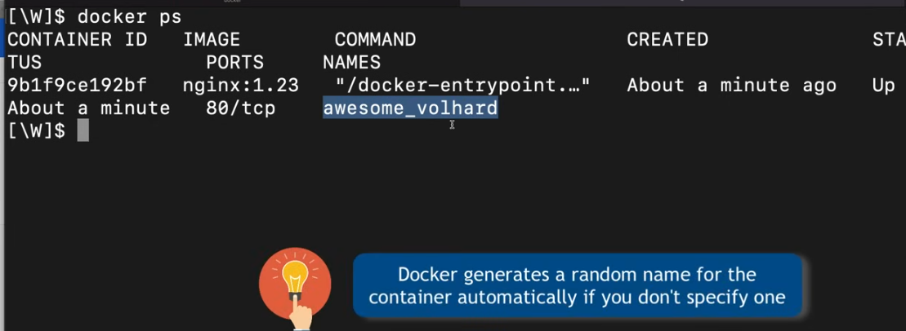

Quando si avvia un container il terminale si blocca, per avviarne uno in background basta digitare `docker run -d nginx:1.23` (`-d` o `--detach`). Per vedere i log del container in backgroud si usa `docker logs id_del_container`.

Docker "pulla" (pulls) l'immagine in automatico se lanciando il comando run non la trova in locale. Inoltre, come già detto, docker è in grado di gestire due versioni della stessa applicazione e qui se ne può vedere un esempio:

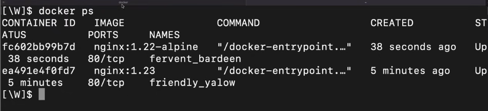

---

## Port Binding

Ora la domanda è: **"Come si può accedere al container?"** Beh, non si può al momento poiché tale applicazione sta venendo eseguita nella rete chiusa *Docker Network*; quindi non può essere acceduta dal browser del pc, ad esempio. 

Va quindi **esposto il container** all'host mediante un **port binding**, ovvero aggiungendo un flair quando si crea il container.

Il comando `docker stop {id}` serve per interrompere l'esecuzione di un container. Bene, ora col seguente comando `docker run -d -p 9000:80 nginx:1.23` cambiando la porta dalla 80 alla 9000 e la `p` sta per `publish`.  

**Ovviamente, un solo servizio può essere eseguito su una certa porta.**

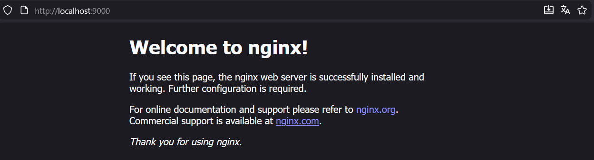

Funziona!

È un buon standard utilizzare la stessa porta che il container sceglie (ex. MySQL usa la 3306, tengo questa).

C'è un importante dettaglio da sottolinare: **il comando docker run crea un nuovo container ogni volta che viene eseguito**. Il comando `docker ps -a (--all)` mostra tutti i container; sia quelli interotti che quelli in esecuzione, mentre `docker start {id}` avvia quel specifico docker. Anziché ricordarsi il nome automatico assegnato da docker è utile rinominare un container con un nome più utile quando esso viene creato aggiungendo un ulteriore flair `docker run --name web-app -d -p 9000:80 nginx:1.23` di cui segue il risultato:

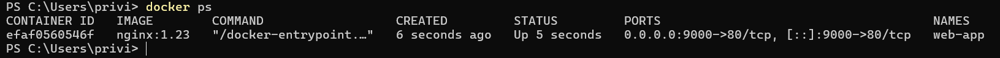

## Private Docker Registries e Registry vs Repository

La già citata **Docker Hub** è un **Public Image registry** ma le aziende creano le proprie immagini che devono restare private. Ogni cloud provider come AWS, Google Cloud e Microsoft Azure ha un servizio dedicato a private Docker registry che necessitano un'autenticazione.

La differenza tra un **Docker Registry** e una **Docker Repository** è che il **registry** è il servizio che ospita e gestisce le immagini, mentre la **repository** è una collezione di versioni della stessa immagine all’interno del registry. In altre parole, un registry contiene molte repository, e ogni repository contiene più tag/versioni di una specifica immagine.

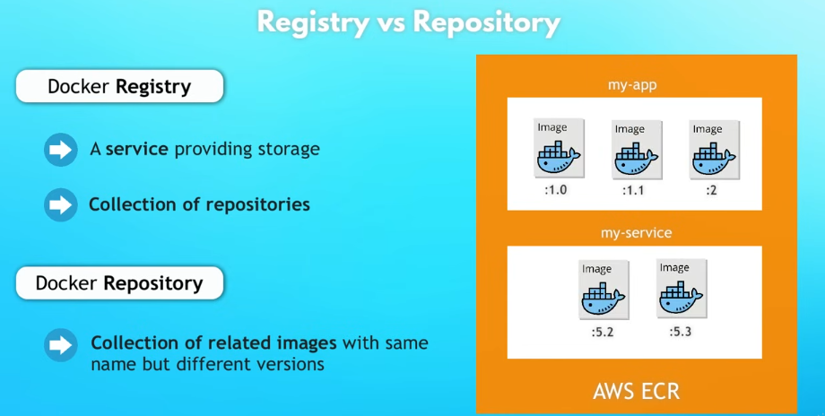

Quindi *Docker Hub* è un registry e con esso si può hostare una repo privata o pubblica per le proprie applicazioni.

## Dockerfile - Create own Images e Build Image

Per **creare una propria Docker Image**  quando l'applicazione sviluppata è pronta è necessario creare una **"definition"** sul come costruire una immagine della nostra applicazione e tale definizione viene scritta in un file denominato **Docker File**.

Mediante un file fornito dalla ragazza artefice del tutorial si può provare a creare la propria Image. 

Il file è un file in Javascript `server.js` che dice "Welcome to my awesome app!" quando accedi al localhost:3000 e un file `package.json` che contiene la dipendenza con la libreria "express" necessaria per avviare l'applicazione.

Nella cartella principale si crea un file denominato **Dockerfile**; per avviare l'app col seguente comando `node src/server.js` serve Node installato. 

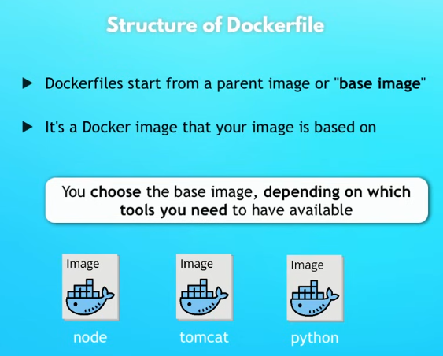

`FROM node:19-alpine` è l'immagine base (genitore) dalla quale poi creare la propria immagine

Altri commenti nel file Dockerfile in `docker-in-1-hour-main/src/Dockerfile`

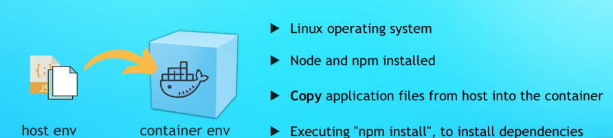

Per poi creare l'immagine bisogna usare il seguente comando: `docker build -t node-app:1.0 .` dove `-t` o `--tag` setta il nome e un tag (opzionale) col seguente formato: "name:tag" mentre l'ultimo parametro è la locazione del file "." sta per la corrente corrente

**RICORDATI DI METTERTI NELLA CARTELLA CORRETTA (DOVE SI TROVA IL FILE Docker) PER POTER COSTRUIRE L'IMMAGINE**

Ecco i risultati del comando:

L'immagine è stata creata ed infatti è possibile vederla digitando `docker images`; inoltre con `docker run -d -p 3000:3000 node-app:1.0` vediamo che funziona se nel browser si digita localhost:3000

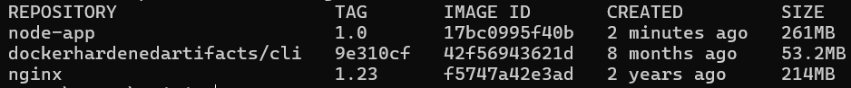

## Docker Overview

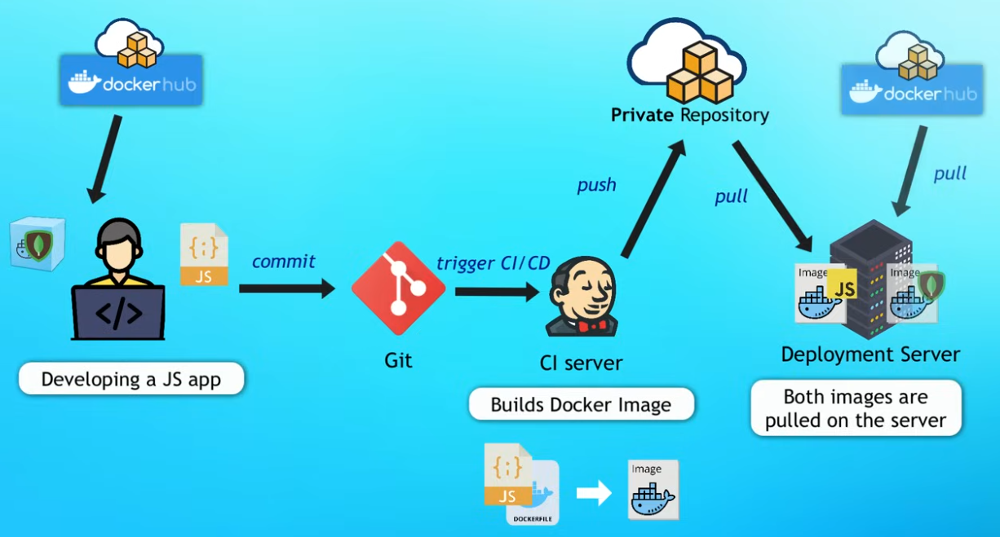

---

## Riassunto Comandi Docker

- **docker pull nginx:1.23**  
  Scarica l’immagine *nginx* versione **1.23** dal registry Docker Hub.

- **docker run nginx:1.23**  
  Avvia un container basato sull’immagine *nginx:1.23* in primo piano (bloccando il terminale).

- **docker ps**  
  Mostra tutti i container **attivi** (in esecuzione).

- **docker run -d nginx:1.23**  
  Esegue nginx in modalità **detached**, cioè in background.

- **docker stop {id}**  
  Ferma il container indicato tramite il suo **ID** o **nome**.

- **docker run -d -p 9000:80 nginx:1.23**  
  Avvia nginx in background esponendo la porta **80 del container** sulla porta **9000 della macchina host**.

- **docker ps -a**  
  Mostra **tutti** i container, sia attivi che stoppati.

- **docker start {id}**  
  Avvia un container **già esistente** e fermo, indicato tramite ID o nome.

- **docker build -t node-app:1.0 .**  
  Costruisce un’immagine Docker usando il Dockerfile nella directory corrente, dandole il tag **node-app:1.0**.

- **docker rm {id}**: Cancella il container 