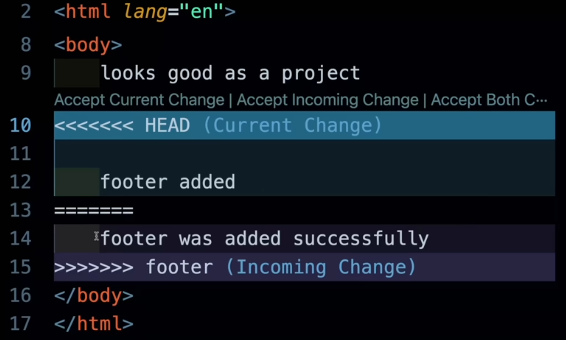
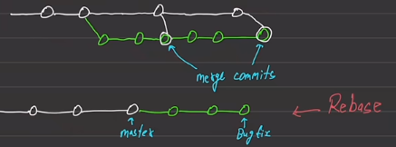
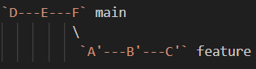

Link al video -> https://www.youtube.com/watch?v=zTjRZNkhiEU&t=18s

Canale -> freeCodeCamp.org

[Riassunto comandi](#riassunto-comandi)

## Introduzione a GIT series

Sviluppare un'applicazione software è tutto fuorchè semplice; collaborare e avere la possibilità di avere dei checkpoint a cui tornare nel caso in cui lo sviluppo del codice porti a problemi risulta quindi essenziale. 

Per **Version Control System** (Versioning System) è proprio ciò di cui si occupa quanto descritto nel paragrafo precedente; di tenere conto delle modifiche effettuate nel codice e di avere la possibilità di fare dei rollback ove necessario.

L'idea dietro questo riassunto non è tanto quella di imparare i numerosi comandi che GIT offre ma bensì come un software viene sviluppato e funziona; capire quindi il workflow di GIT per poi poter sviluppare un software.

Ovviamente **Git** e **Github** sono due cose diverse dato che il secondo è un server provider mentre il primo è proprio il tool che vogliamo imparare.

## GIT init e cartelle nascoste

La prima cosa che si è fatta è creare tre cartelle dai nomi:

- **gitone**, **gittwo** e **gitthree**

In generale, con **Repository** o **Repo** si intende una cartella che viene trackata da Git tenenedo traccia di tutti i file e delle modifiche che vengono effettuate nel tempo in quella cartella.

Il primo comando che si va ad analizzare è **git -v** o **git --version** il quale semplicemente fornisce la versione installata di Git.

Bisogna sempre specificare quali cartella Git deve trackare, esso non tracka tutto in automatico. 

Quello che vogliamo fare adesso è trackare le cartelle **gitone**, **gittwo** ma non **gitthree**.

Un altro comando importante è sicuramente **git status** il quale fornisce lo stato attuale della repository Git nella cartella dove viene eseguito. Quindi esso riferisce:

- su quale **branch** ti trovi;
- quali file sono in attesa di **commit**,
- se ci sono **cambiamenti non salvati**.

Quando viene eseguito questo comando esso va a cercare la cartella nascosta **.git** dove c'è lo storico di tutte le operazioni effettuate. Quindi, spostandoci nel cartella **gitone** lanciamo il comando **git -init** il quale crea la sottocartella nascosta che ci serve per tenere traccia della cronologia.

Ovviamente, al contrario di **git status** il quale viene spesso utilizzato, il comando **git init** viene lanciato solamente quando viene inizializzata la repository. 

Il **commit** statement crea un checkpoint da cui poter fare rollback in un secondo momento.

È possibile immaginare il workflow con questo schema:

`Working Dir` -> **git add** -> `Staging Area` -> **git commit** -> `Repo` -> **git push** -> `Github`

Una volta creata la cartella in cui si effettuerà il lavoro si passa alla staging area dove si metteranno i file pronti per la commit creando quindi il cosiddetto checkpoint. Per caricare il codice su un cloud provider si utilizza infine il comando git push il quale caricherà il codice su, ad esempio, Github.

---

## GIT commits e logs

In queata sezione ci concentreremo in questa sezione dello schema:

`Working Dir` -> **git add** -> `Staging Area` -> **git commit** -> `Repo`

Il comando **pwd** ci fornisce il percorso della directory corrente. Dopo aver aperto la cartella **gitone** ho creato due file txt e lanciando il comando **git status** difatti ho il seguente risultato:

On branch master

No commits yet

Untracked files:
  (use "git add <file>..." to include in what will be committed)
	testone.txt
	testtwo.txt

nothing added to commit but untracked files present (use "git add" to track)

Ovviamente le modifiche sono rilevate e bisognerebbe fare una commit, ma, prima di fare la commit bisogna aggiungere quei file nella "track zone" anche perché risultano non trackati da Git. Supponiamo che testone.txt sia pronto mentre testtwo.txt no, allora useremo il seguente comando:

**git add testone.txt**

Ora il messaggio di **git status** è il seguente:

On branch master

No commits yet

Changes to be committed:
  (use "git rm --cached <file>..." to unstage)
	new file:   testone.txt

Untracked files:
  (use "git add <file>..." to include in what will be committed)
	testtwo.txt

Il primo file si trova quindi nella **staging area** che altro non è che una zona intermedia tra tra 

Invece, **git add .** aggiungerebbe tutti i file correnti nella track zone `git add` e `git commit`, per levare un file in questa zona o si fa la commit oppure si usa il seguente comando:

**git rm --cached <file>**

Per fare una commit è necessario aggiungere un messaggio, il quale serve di base per indicare un sunto delle modifiche effettuate e tale implicazione risulta essere obbligatoria:

**git commit -m "add file one"**

E ora dopo averlo lanciato si ha:

On branch master
Untracked files:
  (use "git add <file>..." to include in what will be committed)
	testtwo.txt

nothing added to commit but untracked files present (use "git add" to track)

Ogni volta che viene eseguita un commit, Git salva:

- un identificatore univoco (hash),
- l’autore del commit,
- la data e l’ora,
- il messaggio di commit.

Con **git log** puoi quindi consultare tutta la “storia” del progetto, cioè l’elenco delle versioni salvate nel tempo. Nel mio caso si ha:

commit e715994387b3a5f4782d3455421b6fd536f04157 (HEAD -> master)
Author: Luca Privitera <129418202+Luke-1310@users.noreply.github.com>
Date:   Mon Nov 10 19:03:04 2025 +0100

    Sium2

commit 7c21a8be17d6caeaee8251105e9e1e52bd84aecc
Author: Luca Privitera <129418202+Luke*-1310*@users.noreply.github.com>
Date:   Mon Nov 10 19:01:10 2025 +0100

    Sium
---

## GIT internal working e configs

Per prima cosa, in questa sezione, si vuole capire meglio come Git apprende quelle informazioni sull'autore etc...

Il comando **git config** serve per visualizzare o modificare le impostazioni di configurazione di Git. Tra le varie informazioni si ha:
- Nome ed indirizzo email usati nei commit
- Preferenza globali, ovvero l'editor di testo o i colori del terminale
- Altre impostazioni specifiche per una singola repository.

In generale ci sono due modalità con cui possiamo configurare il "configuratio file":

- **globlamente** con **git config --global** per impostare la configurazione per tutte i repo dell'utente sul computer. Ad esempio si potrebbe fare: 

-   `git config --global user.name "Luca Rossi"`
-   `git config --global user.email "luca@example.com"`

- **localmente** per impostare la configurazione solo nel repo corrente, ovvero la cartella in cui viene eseguito il comando. Ne segue:

-   `git config user.name "Luca Progetto1"`
-   `git config user.email "progetto1@example.com"`

È stato poi impostato come editor predefinito VS Code per tutte le repo, lanciando questo comando:

**git config --global core.editor "code --wait"**

E come verifica si è utilizzato il comando: **git config --global core.editor** che ha fornito come risultato proprio `code --wait`. Per rendere il sistema corrente di tale cambio, nella barra di ricerca di VS Code è stato digitato ">code" per poi aggiungerlo al PATH.

Un altro file importante è sicuramente **.gitignore**, il quale permette di ignorare dei file dalla tracking zone; in tal modo, è possibile fare una selezione dei file di cui si vuole fare la commit e quali no. Ad esempio informazioni sensibili come l'API key non dovrebbero essere caricate per ovvie motivazioni.

È possibile usare dei generatori di template per questa tipologia di file (.gitignore) basato sulla tipologia di progetto su cui si sta lavorando. 

Il comando **git log --oneline** mostra la cronologia dei commit in una forma breve e leggibile occupando una sola riga, il codice abbreviato del commit (hash) e il messaggio associato. Un esempio potrebbe essere:

`a1b2c3d (HEAD -> main) Aggiunge il file README.md`

---

## GIT merge e GIT conflitcs

In questo paragrafo si vuole cercare di capire meglio il significato di **branch master**; ci si sposta quindi in gittwo, lo si inizializza, si crea un file index.html e mettiamo come visibile la cartella ".git" mediante le impostazioni di VS Code.

Il comando **git branch** serve per gestire i rami (branch) di un repository Git. Un branch è una linea di sviluppo indipendente, cioè una versione parallela del progetto dove puoi lavorare senza toccare il codice principale (di solito nel branch **main** o **master**). Il risultato del comando è:

**git branch**

`* master`

ciò significa che in questo momento stiamo lavorando sul ramo denominato come "master". Graficamente si può rappresentare come segue:

Il ramo verde è quello principale (**master**) mentre ogni nodo corrisponde ad una commit a partire dalla quale è possibile fare un rollback se necessario.

È stata fatta una commit con il file index.html nel branch "master".

Per creare più rami (branches) bisogna innanzitutto avere il nome del nuovo ramo, ad esempio *nav-bar*; quindi si lancia il seguente comando: "git branch nav-bar".

Ora si hanno due rami seppur si sta ancora puntando a quello principale.

* master
  nav-bar

Per cambiare ramo basta digitare **git checkout `nome-ramo`** di cui si può vedere i risultati:

git branch
  master
* nav-bar

Ora bisogna fare un'ulteriore commit affinchè venga creato un nuovo ramo parallelo. A tale scopo viene creato un file *"nav-bar.html"* (**NEL NAV-BAR BRANCH**) per poi add e commit.

Successivamente passando al ramo "master" mediante il comando **git checkout master** il file *nav-bar.html* è sparito! Questo perchè abbiamo cambiato ramo, ovviamente!

Ora in questo ramo è stato creato un file **hero-section.html** e committato. Quindi passando da un ramo all'altro avremmo un secondo file differente in base al ramo scelto:

- hero-section.html nel ramo "master"
- nav-bar.html nel ramo "nav-bar"

Con **head** si intende il nodo in cui si trova il ramo il quale, solitamente, è sempre l'ultimo ma, chiaramente, è possibile puntare anche ad un nodo precedente ove necessario.

È possibile anche unire diversi rami, ciò prende il nome di **merge**. Un worflow semplice consiste nel lavorare in un ramo separato per poi unire quanto fatto nel ramo principale, di seguito uno schema rappresentativo:

Per unire i due rami, master e merge bisogna stare attenti anche ai conflitti che potrebbero insorgere unendoli; in questo caso sono file differenti, quindi non ci dovrebbero essere problemi.

Per fare questa unione, una volta situati nel ramo master, il comando è:

**git merge nav-bar**

così da unire i due rami! 

Per poter cancellare la branch "nav-bar", che ormai ha concluso il suo scopo, basta andare in una branch diversa (master) e digitare:

**git branch -d nav-bar**

Qualora si volesse passare ad una nuova branche in un solo comando si può fare_ **git checkout -b footer**, per riunirla col branch master nuovamente.

Ora, è chiaro che i due merge sono andati a buon fine perché i file erano tutti diversi non provocando nessun **conflitto**.

Un **conflitto** in Git si verifica quando due branch modificano **le stesse righe di codice** in un file, e Git **non sa quale versione tenere** durante un’operazione di *merge* o *rebase*.

In questi casi, Git interrompe il processo e ti chiede di risolvere il conflitto manualmente. Vediamo un esempio pratico:

Nel file mostrato, Git ha trovato un conflitto tra il branch corrente (`HEAD`) e il branch `footer`.

Tutto ciò che si trova tra <<<<<<< HEAD e ======= rappresenta la versione corrente (cioè quella del branch in cui ti trovi).

Tutto ciò che si trova tra ======= e >>>>>>> footer rappresenta la versione in arrivo dal branch che stai cercando di unire (footer in questo caso).

---

## GIT diff e stashing

Il comando **git diff** serve per vedere le differenze tra varie versioni del codice nel repo, ovviamente ci si riferisce alla versioni di uno stesso file.

Per leggere il risultato di questo comando bisogna saper interpretare i simboli; si supponga quindi che ci sia un *file a* ed un *file b* che corrisponde ad una versione aggiornata del *file a* (è quindi lo stesso file):

- "---" rappresenta la versione precedente del file **NON RAPPRESENTA IL CODICE RIMOSSO**

- "+++" rappresenta la nuova versione **NON RAPPRESENTA IL CODICE AGGIUNTO**

Poi, nel corpo del diff si ha che le righe che iniziano con "-" sono state rimosse o modificate rispetto alla versione precedente e le righe che iniziano con "+" sono nuove o modificate. Ne segue un esempio:

--- a/index.html
+++ b/index.html
@@ -8,7 +8,7 @@

 <body>
-  footer added
+  footer was added successfully
 </body>

**git diff** non da nessun risultatom invece, **git diff --staged** ci fornsice il seguente risultato:

git diff --staged
diff --git a/index.html b/index.html
index a995a0f..b0197e1 100644
--- a/index.html
+++ b/index.html
@@ -6,6 +6,7 @@
     <title>Documento 1</title>
 </head>
 <body>
-    Eccoci qui, nel primo documento.
+    I would love to add a nav-bar here
+    Eccoci qui, nel primissimo documento.
 </body>
 </html>
\ No newline at end of file

Nel caso in cui ci fossero stati più file allora avremmo avuto un output del genere:

diff --git a/footer.html b/footer.html
index 61d4aaf..6bd7733 100644
--- a/footer.html
+++ b/footer.html
@@ -1,3 +1,3 @@
 <footer>
-    nice footer
+    nice footer wow!
 </footer>
\ No newline at end of file
diff --git a/index.html b/index.html
index a995a0f..b0197e1 100644
--- a/index.html
+++ b/index.html
@@ -6,6 +6,7 @@
     <title>Documento 1</title>
 </head>
 <body>
-    Eccoci qui, nel primo documento.
+    I would love to add a nav-bar here
+    Eccoci qui, nel primissimo documento.
 </body>
 </html>
\ No newline at end of file

Non viene mai mostrato tutto il file ma solo alcune porzioni di esso.

Altri esempi di utilizzo di questo comando potrebbe esssere il confronto tra due commit con **git diff HEAD~1 HEAD** oppure tra due branch con **git diff main feature-branch**.

**git stash** serve per salvare temporaneamente le modifiche non ancora committate (sia file modificati che nuovi file tracked) e ripulire la working directory, così puoi lavorare su qualcos’altro senza perdere il lavoro svolto.

Si è creato un nuovo branch di nome *bugfix* e si ha modificato il file *footer.html* per poi cercare di cambiare branch ma questo cambio di ramo è stato annullato con il seguente errore:

git switch footer

error: Your local changes to the following files would be overwritten by checkout:
	footer.html
Please commit your changes or stash them before you switch branches.
Aborting

Ciò è avvenuto poiché ci sono delle modifiche da gestire in questo caso si può scegliere di metterle in una zona di stage se sono pronte per la commit oppure in stash se bisogna ancora lavorarci sopra; digitano **git stash** e poi **git switch footer** ho potuto cambiare ramo mettendo da parte il lavoro che stavo facendo.

Per riprendere le modifiche una volta tornati nel ramo *bugfix* basta digitare **git stash pop** e si ha:

On branch bugfix
Changes not staged for commit:
  (use "git add <file>..." to update what will be committed)
  (use "git restore <file>..." to discard changes in working directory)
	modified:   footer.html

no changes added to commit (use "git add" and/or "git commit -a")
Dropped refs/stash@{0} (21707242fa826918a60679f12db16eb1944a7744)

Tale comando applica l'ultimo stash (di default stash@{0}) e lo rimuove dalla lista.

**git stash list** mostra tutti gli stash salvati finora con una lista numerata:

stash@{0}: WIP on main: 123abcd fix navbar bug
stash@{1}: WIP on footer: added copyright section

**git stash apply stash@{n}** serve per applicare uno stash senza rimuoverlo della lista

**git stash drop stash@{n}** o **git stash drop "stash@{n}" su windows** cancella uno stash specifico mentre **git stash clear li cancella tutti**

---

## GIT rebase is not that scary

È un comando che si occupa di "riscrivere" lo storico di un programma e che quindi va utilizzato con parsimonia. In generale, questo comando può essere utilizzato come alternativa al merge oppure come clean up tool; nell'immagine successiva il primo grafo si ha effettuando una merge mentre il secondo lo si ottiene effettuando un **rebase**.

**Questo comando non è pensato per essere eseguito sul main branch ma bensì su ramo secondario!!!!**

serve a spostare una serie di commit su un altro punto della storia del repository, riscrivendo la cronologia.

In pratica, invece di fare un merge che crea un commit di unione, il rebase “riapplica” i tuoi commit su un altro branch, come se fossero stati creati lì fin dall’inizio.

**git rebase <branch-di-destinazione>**

---

## Insight of pushing code to GITHUB

Di base, la comunicazione con **Github**, che ricordo essere un server provider dove poter conservare il proprio codice e non è interscambiabile con Git, avviene mediante **SSH (Secure Shell)** il quale è un protocollo di comunicazione che consente di connettersi a un server in modo cifrato e autenticato. Esso utilizza una **coppia di chiavi crittografiche**, una pubblica che viene caricata sul proprio account Github e una privata solo sul tuo computer.

L'autenticazione nel mio caso è già stata fatta in maniera automatica quando scaricai Github Desktop difatti sono riuscito a fare una push su Github senza dover compiere alcuna procedura proprio perché questa macchina da cui sto scrivendo questo file è già autenticata.

In questo caso però non è esplicita la chiave SSH.

----*nulla di troppo importante da aggiungere*----

## How to make pull request and open source contribution

----*nulla di troppo importante da aggiungere*----

-----

## Riassunto comandi

Ecco una lista dei comandi utilizzati in questo documento:

- **git -v** oppure **git -version**: per visualizzare la versione di Git in uso

- **git status**: fornisce lo stato attuale della repository Git nella cartella dove viene eseguito; nello specifico il branch e se ci sono modifiche da osservare.

-  **git -init**: inizializza la cartella creando il file nascosto **.git** che serve per tenere traccia delle modifiche.

- **git add**: aggiunge un file nella staging area

- **git add .**: aggiunge tutti i file nella staging area

- **git commit -m messaggio**: effettua la commit dei file nella stage area con un messaggio per spiegare le modifiche

- **git commit -am "messaggio"**: aggiunge le modifiche nella staging zone e fa la commit con quel messaggio (due step in una riga) e vale   solo per i file giàtracciati da Git e *non per quelli nuovi*.

- **Schema del workflow**: `Working Dir` -> **git add** -> `Staging Area` -> **git commit** -> `Repo` -> **git push** -> `Github`

- **git rm --cached <file>**: per levare un file dalla staging zone.

- **git log**: puoi quindi consultare tutta la “storia” del progetto, cioè l’elenco delle versioni salvate nel tempo.

- **git config**: serve per visualizzare o modificare le impostazioni di configurazione di Git, come il nome e la mail dell'utente.

- **git log --oneline**: mostra la cronologia dei commit in una forma breve e leggibile occupando una sola riga.

- **git branch**: mostra le diverse branch presenti nella cartella di lavoro e punta con un * la branch corrente.

- **git checkout `nome-ramo`**: per cambiare ramo.

- **git merge nav-bar**: per unire due rami, in questo caso si unisce il ramo "nav-bar" con il ramo "master" 

- **git branch -d nav-bar**: cancella il ramo "nav-bar"

- **git diff**: mostra le differenza tra una versione dello stesso file prima e dopo le modifiche; bisogna però aggiungere un informazione dopo diff in modo tale da "guidare" la risoluzione del comando.

- **git diff --staged**: mostra le differenze tra la versione corrente (con le modifiche non aggiunte) e la versione precedente.

- **git diff HEAD~1 HEAD**: mostra le differenze tra l'ultima commit e la commit prima di HEAD, ovver il penultimo commit.

- **git switch -c nome-branch**: crea un nuovo branche *"nome-branch"* e sposta l'ambiente di lavoro su quella nuova branch.

- **git stash**: serve per salvare temporaneamente le modifiche non ancora committate (sia file modificati che nuovi file tracked) e ripulire la working directory.

- **git stash pop**: applica l'ultimo stash (di default stash@{0}) e lo rimuove dalla lista.

- **git stash list**: mostra tutti gli stash salvati finora con una lista numerata:

stash@{0}: WIP on main: 123abcd fix navbar bug
stash@{1}: WIP on footer: added copyright section

- **git stash apply stash@{n}**: serve per applicare uno stash senza rimuoverlo della lista.

- **git stash drop stash@{n}** o **git stash drop "stash@{n}" su windows**: cancella uno stash specifico mentre **git stash clear li cancella tutti**.

- **git checkout 31aea8d**: sposta il puntatore al commit corrente (HEAD) su quel commit specifico.

- **git rebase <branch-di-destinazione>**: serve a spostare una serie di commit su un altro punto della storia del repository, riscrivendo la cronologia; invece di fare un merge che crea un commit di unione, il rebase “riapplica” i tuoi commit su un altro branch, come se fossero stati creati lì fin dall’inizio. *Tale comando non si fa mai sul ramo principale.* Ne segue un esempio:

Si vuole aggiornare 'feature' con le modifiche di 'main'.

*git checkout feature*

*git rebase main*

I commit A, B, C sono stati riapplicati sopra l'ultimo commit di `main`.

Quando si configura Git per la prima volta sul tuo PC:

- **git config --global user.name "Luca"**

- **git config --global user.email "tu@email.com"**

- **git clone <url_del_repo>**: serve per "scaricare" un progetto da Github

- **git push**: manda i commit locali al repository remoto (quindi su Github)

- **git push -u origin nome-branch**: per fare la prima commit su un determinato branch

- **git pull**: serve per poter scaricare e unire le modifiche da Github

In Git, un remote è un collegamento a un repo remoto; quando si clona un progetto da Github, Git crea automaticamente un remote chiamato: **origin** che punta all'URL del repo su Github.

- **git remote -v**: mostra tutti i remote configurati e gli URL associati, l'output è il seguente:

*origin  git@github.com:luca/mio-repo.git (fetch)*
*origin  git@github.com:luca/mio-repo.git (push)*

- **git remote add**: collega un repo locale a uno remoto oppure aggiunge un secondo collegamento a un altro remoto.

*git remote add <nome> <url>* 
