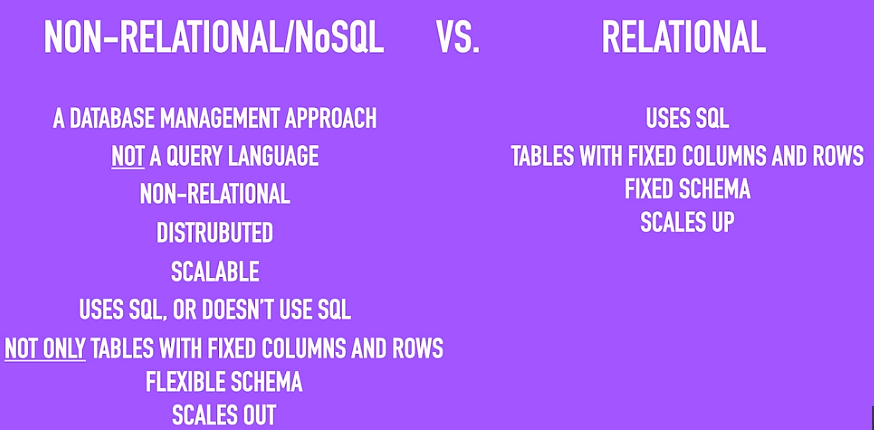
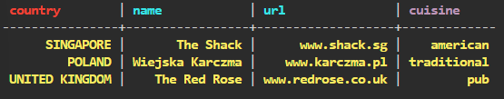
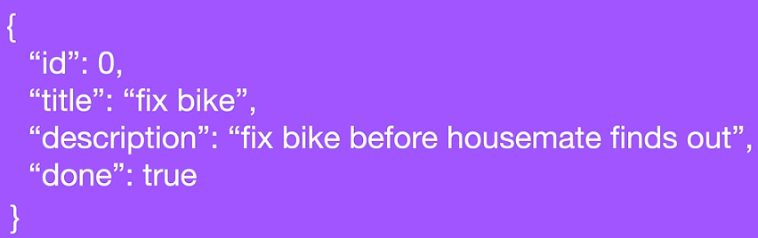
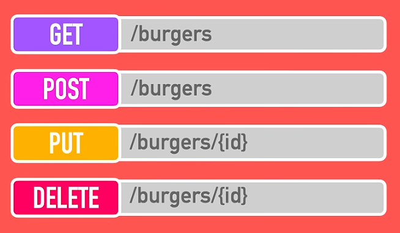
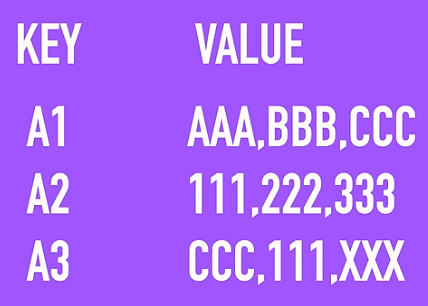

Link al video -> https://www.youtube.com/watch?app=desktop&v=xh4gy1lbL2k
Canale -> freeCodeCamp.org

# IL VIDEO È OBSOLETO! Per tanto si sono raccolte solamente le informazioni teoriche senza però poter effettuare tutti i test voluti.

## What is NoSQL? Why use NoSQL? SQL vs NoSQL and Setting up

NoSQL è un modalità di approccio per gestire database in maniera super flessibile in quanto consente una grossa varità di tipi diversi di DB come **key value** (*database chiave-valore*), **document** (*database a documenti*), **tabular** (*database a colonne*) e **graph formats** (*database a grafi*). 

Un databse NoSQL è definito dalle seguenti caratteristiche:

- **Non relazionale**: indica che il database non utilizza tabelle relazionali con schemi rigidi come i database SQL.

- **Distribuito**: significa che i dati sono suddivisi e replicati su più nodi o server. 

- **Scalabile**: il sistema può crescere facilmente aggiungendo nuovi nodi senza grandi modifiche.

Inoltre, esso è anche **partition tolerant** (tollerante alle partizioni) ovvero è capace di funzionare anche quando alcuni nodi non riescono più a comunicare tra loro a causa di problemi di rete.

La differenza principale tra **SQL** e **NoSQL** è che il primo è un linguaggio con delle proprie regole per effettuare query mentre il secondo è un approccio per gestire un database; infatti si potrebbe dire che `NoSQL` stia per `Not only SQL`.

Ci sono due ragioni principali sul perché si dovrebbe usare un NoSQL databse:

1) **Application Development Productivity**: quando si sviluppa un'applicazione ci vuole molto tempo per gestire tutti i tipi di dati necessari e a tal proposito permette di semplificare tale onere.

2) **Large Scale Data**: grandi quantità di informazioni sono semplici da gestire con questa tipologia di approccio invece di utilizzare un databse relazionale.

Riassumendo, le differenze tra un SQL e NoSQL sono:

Per `scale up` si intende uno sviluppo verticale che serve nel rendere più performante un singolo database.

Per `scale out` si intende uno sviluppo orizzontale ovvero l'aggiunta di più nodi al sistema permettendo la distribuzione dei dati. 

Un database è composto da più livelli:

- **Interfaccia**: è il primo livello, quello con cui l’utente interagisce. Include linguaggi come SQL o API che permettono di interrogare, modificare e gestire i dati senza doversi preoccupare dei dettagli interni. Come interfaccia si utilizzerà *DataStax Astra DB* ovvero un `Database-as-a-Service (DBaaS)` completamente gestito, basato su *Apache Cassandra*. Siccome esso utilizza proprio *Apache Cassandra* si accennerà anche al **CQL (Cassandra Query Language)**. Esso offre un modello simile a SQL dove i dati vengono posti in tabelle contenenti righe e colonne.

- **Livello di esecuzione**: è il livello intermedio che interpreta le richieste dell’interfaccia. Comprende i meccanismi che traducono le query o le operazioni in istruzioni comprensibili dal motore del database (parser, ottimizzatore di query, piani di esecuzione).

- **Livello di Storage**: è il livello più basso e si occupa della gestione fisica dei dati. Include l’archiviazione su disco, gli indici, la gestione delle transazioni, la concorrenza e la struttura dei file che contengono i dati reali.

Dopo essermi loggato su Astra ho creato un db dal nome `fcc_tutorial` e con il seguente keyspace `tabular` che è la tipologia di database che tratterò per primo. Per keyspace si intende il primo livello di suddivisione logica dei dati all'interno di un cluster NoSQL; raggruppa quindi tabelle e definisce le reegola di replica e distribuzione per quel gruppo di tabelle.

---

## Tabular Type 

Conosciuto anche come database a colonne esse consiste in tabelle relazionali, ovvero con un certo schema alla base. Ho creato una tabella dal nome `Books` con i seguenti attributi:

- `Book ID`: *"UUID -> universal unique identifier"*
- `Author`: *text*
- `Title`: *text*
- `Year`: *int*
- `Categories`: *set of text*
- `Timestamp`: *timestamp*

Ho definito lo schema della tabella e il campo **“Book ID”** fungerà da chiave del record, ovvero l’elemento utilizzato per individuare rapidamente quel dato.
Nei database NoSQL questa chiave è chiamata **“chiave di partizione”** perché determina in quale nodo del cluster verranno memorizzati i dati. Le righe che condividono la stessa chiave di partizione vengono infatti salvate nello **stesso nodo**, e una query basata su quella key restituirà **tutte** le righe associate a quella partizione.

Quindi, ora, su Astra ho iniziato digitando il seguente comando nella CQL Console `describe keyspaces;` per visualizzare tutte le keyspaces presenti nel db in quel momento. Il seguente comando permette di usare una specifica keyspace `use tabular;` per poi digitare `CREATE TABLE IF NOT EXISTS books (...)` con tutti i campi come segue:

`CREATE TABLE IF NOT EXISTS books (`
        `... bookid uuid,`
        `... author text,`
        `... title text,`
        `... year int,`
        `... categories set <text>,`
        `... added timestamp,`
        `... PRIMARY KEY (bookid)`
        `... );`

per poi fare la seguente insert:  `INSERT INTO books(bookid, author, title, year, categories, added) VALUES (uuid(), 'Bobby Brown', 'Dealing With Tables', 1999, {'programming', 'computers' }, toTimeStamp(now()));`. Per poi vedere se funziona basta fare `SELECT * from books` e... 

funziona! 

Dopo aver fatto un ulteriore INSERT ho stampato nuovamente tutti gli insert. Per selezionare un singolo record dalla tabella basta cercare il uuid desiderato e usare il segunte comando:

`SELECT * FROM books`
        `... where bookid = *codice uuid*`

Per selezionare più elementi dalla tabella bisogna lavorare con le partizioni; per fare ciò ho creato una nuova tabella `restaurant_by_country` come segue:

`CREATE TABLE IF NOT EXISTS restaurant_by_country (`
        `... country text,`
        `... name text,`
        `... cuisine text,`
        `... url text,`
        `... PRIMARY KEY (country), name, url`
        `... ) WITH CLUSTERING ORDER BY(name DESC, url ASC);`

Tutti i dati relativi a questa tabella verranno distribuiti nel database in base al paese mentre gli altri due attributi *name* e *url* vengono definiti come **CLUSTERING KEYS** e sono gli attributi che ordinano fisicamente i dati all'interno di una stessa partizione determinando l'ordine di restituzione delle righe quando si fa una quet sulla stessa partition key.

Dopo aver fatto alcuni insert la stampa di tutti i ristoranti è la seguente:

Per poi vedere, ad esempio, tutti i ristoranti locati in singapore basta scrivere `SELECT * from restaurant_by_country WHERE country='SINGAPORE';`.

I **database tabular NoSQL** utilizzano una struttura a tabelle, ma **non sono equivalenti ai database relazionali**. Nei database SQL lo schema è rigido, esistono relazioni tra tabelle tramite join e le chiavi servono solo a identificare i record. Nei sistemi tabular NoSQL lo schema è più flessibile, non esistono join e i dati vengono spesso duplicati per velocizzare le query. 

Le *chiavi* hanno un ruolo strutturale: la **partition key** decide in quale nodo vengono salvati i dati, mentre le **clustering keys** ordinano fisicamente le righe all’interno della partizione. I database relazionali scalano potenziando un singolo server, mentre quelli tabular NoSQL scalano aggiungendo nodi al cluster. Le query SQL sono flessibili e complesse, mentre nei database tabular NoSQL sono rapidissime ma devono essere progettate in anticipo in base ai pattern di accesso ai dati.

---

## Document Type 

I **document database** sono orientati ai documenti e sono semplici da gestire perché hanno uno schema molto più flessibile; gli oggetti hanno una `chiave` e dei `valori` come segue:

Questa tipologia di documenti è nota con il nome di **JSON (JavaScript Object Notation)** ed è il formato più popolare quando si parla di database ad oggetti. Un gruppo di documenti è detto **collezione**; andando a sostituire le tabelle usate precedentemente.

Si farà quindi una collezione di oggetti mediante l'utilizzo di una `document API`. API sta per **Application Programming Interface** ed è un insieme di regole e strumenti che permette a due programmi o applicazioni di comunicare e scambiarsi dati in modo standardizzato.

Verrà utilizzato per comunicare col database che ho creato; in questo caso si utilizzeranno delle `richieste HTTP`. I metodi HTTP più utilizzati sono:

Molto brevemente, `GET` serve a **recuperare** le informazioni, `POST` a **inviarle o crearle**, `PUT` a **aggiornare** dati esistenti e `DELETE` a **rimuoverli**.

Per interagire con i dati sono necessari diversi endpoint. Un **endpoint** è un URL o un URI a cui un client può inviare richieste HTTP per interagire con una specifica risorsa del server. Per il metodo `GET` si ha: `www.my-burger-api.com/burgers`così come per `POST` mentre per editare `PUT` o `DELETE` un record singolo si usa `www.my-burger-api.com/burgers/{id}*`.

Ho creato un nuovo `keyspace` di nome *document* ed è risultato quindi necessario un token per poter comunicare con il databas il quale è stato ricavato nella sezione *connect*.

--- VIDEO OBSOLETO! IMPOSSIBILE PROSEGUIRE ---

In generale, un esempio di GET potrebbe essere il seguente:

`{`
   `"data": {`
      `"2axc332...":{`
      `"description": "make dinner to apologize"`
      `"done": false`
      `"id": 1`
      `"title": "Make Dinner"` 
      `}`
   `}`
`}`

La *terza riga* corrisponde alla chiave dell'oggetto JSON trattato il cui valore è a sua volta un altro oggetto.

---

## Key-Value Type

È tipologia semplice di database dove si ha una coppia di due colonne, una per la chiave ed un'altra per il valore; in realtà è possibile avere anche più di una colonna per salvare i valori.

--- VIDEO OBSOLETO! IMPOSSIBILE PROSEGUIRE ---

---

## Graph Type

È ottimale per poter salvare delle informazioni con delle relazioni tra loro, si sta quindi parlando di `nodi`. Ogni nodo è collegato dda un arco che rappresenta la relazione.

---
