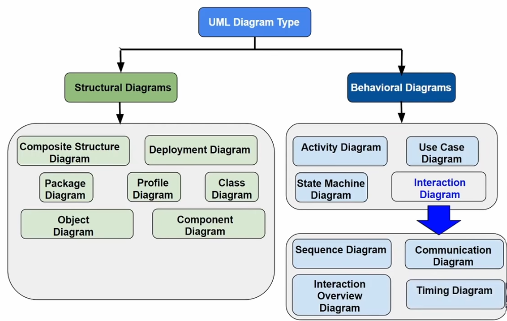
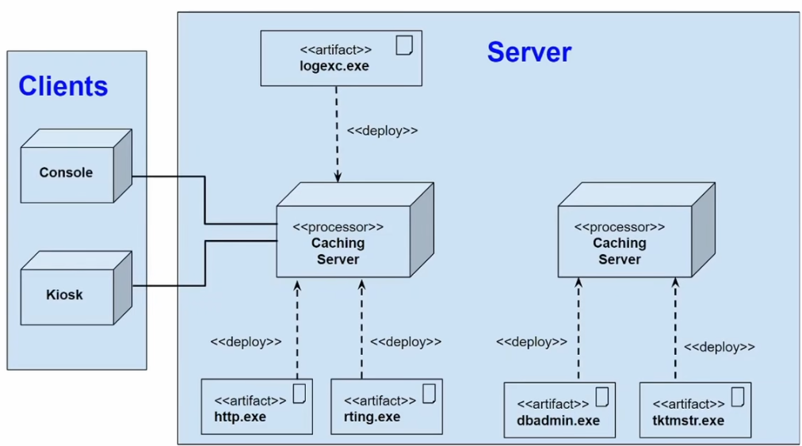
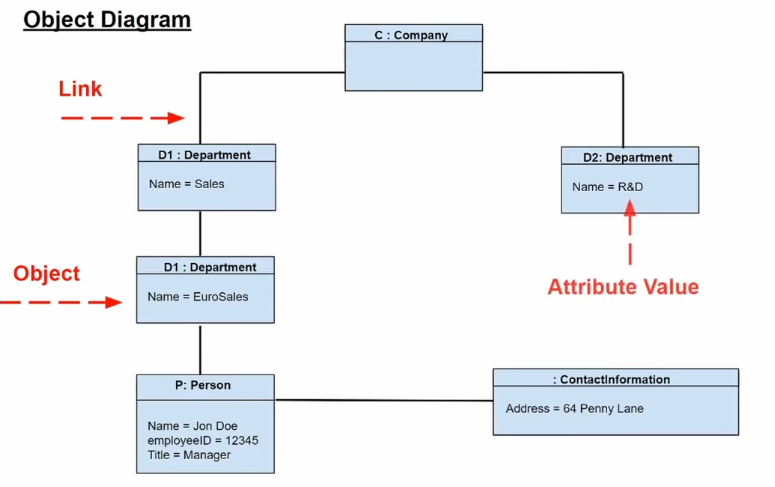
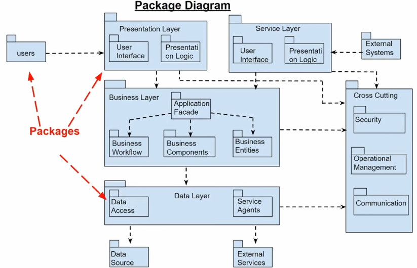
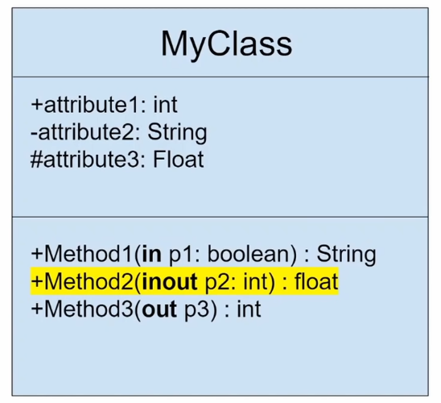
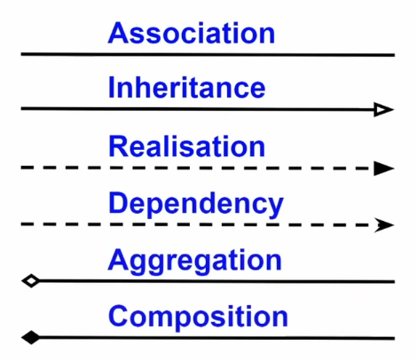
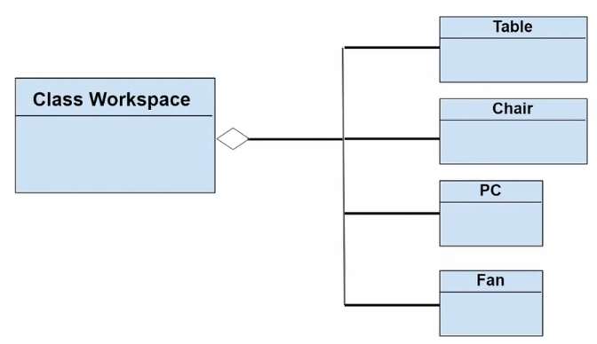
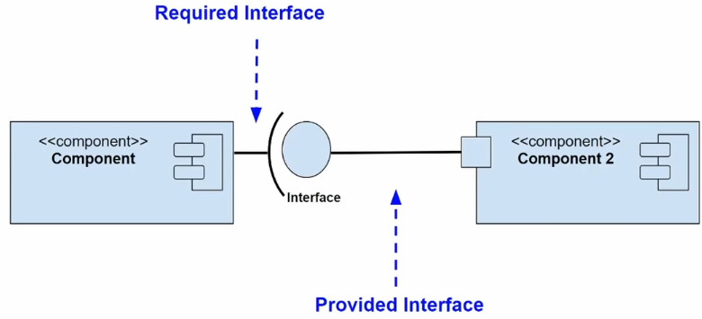
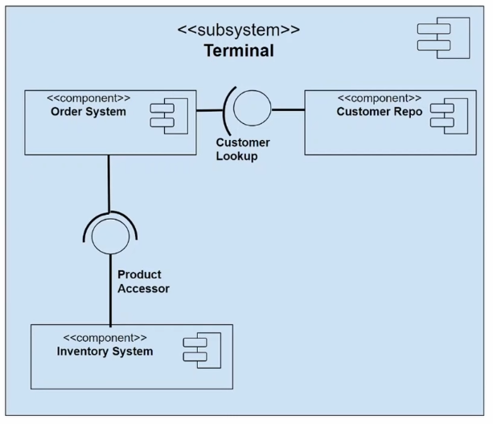
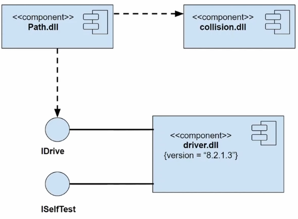

Link al video -> https://www.youtube.com/watch?v=WnMQ8HlmeXc&t=170s   

## UML

UML sta per **Unified Modeling Language**. Si tratta di un linguaggio di modellazione standardizzato che utilizza un insieme di forme grafiche e interazioni per aiutare lo sviluppatore nella progettazione di sistemi software, in particolare quelli orientati agli oggetti.

Lo scopo principale di UML è fornire un insieme di notazioni convenzionate e comprensibili universalmente, utilizzabili in tutti i contesti di sviluppo orientato agli oggetti.

UML mette a disposizione una vasta gamma di costrutti e attività (constructs and activities) che permettono di descrivere la struttura, il comportamento e le interazioni di un sistema in modo chiaro e standardizzato.

## Diagrammi UML

I diagrammi UML si suddividono in due grandi categorie:

1. **Structural Diagrams** (Diagrammi Strutturali)

Descrivono la struttura statica del sistema, ovvero come sono organizzati i vari elementi e come si relazionano tra loro.

I principali diagrammi strutturali sono:

**Class Diagram** – mostra le classi e le loro relazioni.

**Object Diagram** – rappresenta istanze concrete di classi e relazioni.

**Package Diagram** – illustra la suddivisione del sistema in pacchetti o moduli.

**Component Diagram** – descrive i componenti software e le loro dipendenze.

**Deployment Diagram** – mostra la distribuzione fisica dei componenti su nodi hardware.

**Composite Structure Diagram** – dettaglia la struttura interna di una classe o componente complesso.

**Profile Diagram** – consente di estendere UML con elementi specifici per un particolare dominio.

2. **Behavioral Diagrams** (Diagrammi Comportamentali)

Descrivono la dinamica del sistema, ovvero il comportamento, le interazioni e i flussi di attività.

I principali diagrammi comportamentali sono:

**Activity Diagram** – rappresenta il flusso di attività e processi.

**Use Case Diagram** – descrive le funzionalità del sistema dal punto di vista dell’utente.

**Interaction Diagrams** – rappresentano le interazioni tra oggetti o componenti.
Questi si suddividono ulteriormente in:

**Sequence Diagram** – mostra la sequenza temporale dei messaggi tra oggetti.

**Communication Diagram** – evidenzia le relazioni tra oggetti e i messaggi scambiati.

**Interaction Overview Diagram** – combina aspetti di activity e sequence diagram.

**Timing Diagram** – rappresenta il comportamento nel tempo dei singoli oggetti.

Il **Class Diagram** è la tipologia più comune di tecnica e viene utilizzata in molti diagrammi orientati agli oggetti. Esso descrive le tipologie degli oggetti e i diversi tipi di relazioni statiche che esistono tra essi. Tra i diversi tipi di relazioni statiche ci sono le associazioni, le quali descrivono le relazioni tra le istanze degli oggetti con una certa cardinalità, e l’**ereditarietà**, per la quale un oggetto può avere due o più eredi del tipo “pagamento”: **soldi** o **carta** i quali ereditano gli attributi dell'entità base e ne aggiungono delle proprie caratteristiche.

Il **Deployment Diagram** si occupa di rappresentare l’architettura fisica di un sistema orientato agli oggetti, mostrando come i componenti software vengono distribuiti e interconnessi sull’hardware. Questo tipo di diagramma consente di visualizzare i nodi, i dispositivi e le connessioni di rete che compongono il sistema, fornendo una panoramica chiara della sua struttura di esecuzione, come illustrato nell’immagine d’esempio sottostante.

L’**Object Diagram** è un’istanza del diagramma delle classi che rappresenta lo stato del sistema in un preciso istante di tempo. L’utilizzo di questa tipologia di diagramma risulta piuttosto limitato, poiché viene impiegato principalmente per mostrare esempi concreti di oggetti e relazioni derivati dal **Class Diagram**, utili a comprendere meglio la struttura e il comportamento del sistema in un momento specifico.

Il **Package Diagram** è un diagramma strutturale che rappresenta l’organizzazione e la suddivisione di un sistema in pacchetti, evidenziando le dipendenze e le relazioni tra di essi

Il **Composite Structure Diagram** è simile al diagramma delle classi, ma viene utilizzato per analizzare un sistema a un livello più dettagliato, mettendo in evidenza le **componenti interne** e le **interazioni tra le parti** di una singola classe o di un elemento complesso. Questo diagramma consente quindi di studiare la struttura interna di un componente, individuando le piccole parti che lo compongono e le modalità con cui collaborano per realizzare il comportamento complessivo del sistema.

Il **Profile Diagram** permette di estendere e personalizzare i modelli UML tramite la definizione di **stereotipi**, **tagged values** e **vincoli**. Questo tipo di diagramma viene utilizzato per adattare l’UML a domini specifici o a particolari esigenze di modellazione, consentendo di aggiungere nuove semantiche senza modificare la struttura base del linguaggio.

Gli **Activity Diagram** sono rappresentazioni grafiche dei **workflow** e delle **attività** di un sistema. Grazie al supporto di scelte, iterazioni e processi concorrenti, permettono di descrivere e gestire il flusso logico delle operazioni che compongono il comportamento complessivo del sistema.

Il **State Machine Diagram** è un tipo di diagramma utilizzato in UML per descrivere il **comportamento dinamico** di un sistema, mostrando gli **stati** in cui può trovarsi un oggetto, le **transizioni** tra questi stati e le **condizioni** che ne determinano il cambiamento.

Il **Sequence Diagram** modella le **interazioni tra oggetti** in base a una sequenza temporale, illustrando come i messaggi vengono scambiati tra essi per realizzare una determinata funzionalità o processo del sistema.

## Diagramma delle Classi

Una classe è un **template** per creare oggetti, definendo **attributi** per rappresentarne le caratteristiche e **metodi** per descriverne il comportamento. Ad esempio, una classe di tipo `Class: Dog` può avere attributi come `Colour` e `Age`, mentre i metodi sono definiti tramite le loro **signature**.

La struttura di una classe in un **Class Diagram** è la seguente: in cima si trova il **nome della classe**, subito sotto gli **attributi** con il relativo tipo di dato (es. `-Color: String`), e infine i **metodi** con il tipo di dato che essi restituiscono (es. `+setAge(): void`).

Davanti agli attributi si utilizza il simbolo `-` per indicare che sono **privati**, mentre davanti ai metodi si utilizza il simbolo `+` per indicare che sono **public**; inoltre, `#` indica **protected**, mentre `~` indica **package locale**.

Ciascun paramentro in un metodo può essere indicato in base alla direzione rispetto alla chiamata della funzione. Nell'esempio qui sotto il primo metodo accetta p1 come input, il secondo accetta sia in input che in output p2 ed il terzo solamente in output accetta p3.

## Relazioni tra classi in UML

Verranno ora descritte sei tipi di relazioni in UML:

- **Associazioni**: Le associazioni collega due classi differenti per indicare che esse interagiscono tra di loro. è possibile anche specificare la cardinalità tra di loro, ad esempio un studente può imparare da diversi tutor e un tutor può insegnare a diversi studenti.

- **Ereditarietà**: descrive la relazione tra una **classe genitore** e le sue **classi derivate**. La punta della freccia è sempre diretta verso la classe genitore.

- **Realizzazione**: rappresenta la relazione tra un’**interfaccia** e le **classi** che la implementano.

- **Dipendenza**: è un caso particolare di associazione tra due classi, in cui il metodo di una classe utilizza un oggetto di un’altra classe. Ad esempio, la classe `Persona` può avere un metodo `hasRead(book): boolean` che prende in input un oggetto `Book`, collegando così le due classi.

- **Aggregazione**: è un tipo speciale di relazione in cui una classe **fa parte di un’altra**; ad esempio, la classe `Casa` può essere composta da diverse altre classi. L’aggregazione è rappresentata da una **linea continua** con un **rombo** sulla classe che rappresenta l’aggregazione.

- **Composizione**: è una forma più forte di aggregazione, in cui la **classe aggregata** viene cancellata quando la **classe aggregatore** viene eliminata.

## UML Component Diagram

L'**UML Component Diagram** viene utilizzato per modellare gli aspetti **fisici** dei sistemi orientati agli oggetti. Si può considerare questa tipologia di diagrammi come una particolare forma di **Class Diagram**, ma con un focus sui **componenti** del sistema.

Il diagramma rappresenta il sistema a un **alto livello di funzionalità**, dove ciascun componente ha un **compito specifico** e interagisce con gli altri elementi quando necessario.

Per **required interface** si intendono gli elementi di cui un componente ha bisogno per eseguire correttamente il compito a esso assegnato.

I dati passano attraverso diversi componenti per essere poi messi in output tramite le **porte** sulla sinistra dell’immagine. Gli elementi sulla sinistra sono noti come **provided interface**, e gli altri componenti possono interagire con esse per utilizzare le informazioni in output al fine di completare le proprie attività. È importante ricordare che i componenti interni fanno parte del **riquadro azzurro**, che rappresenta l’intero sistema.

Un **componente** è un modulo del sistema che contiene le informazioni, rappresentato come un rettangolo con eventuali ulteriori componenti al suo interno. Nel seguente esempio si possono osservare due tipi di **interfacce**:

La **provided interface** è rappresentata da una **circonferenza**, indicando la componente che viene fornita al sistema; questo simbolo è noto come **lollipop**. La **required interface** si conclude con una **semicirconferenza** e rappresenta la componente di cui il sistema ha bisogno per completare la propria task.

La porta viene rappresentata con un quadrato lungo il bordo del sistema o del componenta è utilizzata per indicare required o provided interface.

Il **Subsystem Classifier** è un particolare tipo di **Component Classifier**, poiché il sottosistema eredita le stesse regole e caratteristiche di un componente. L’unica differenza risiede nel fatto che l’elemento **subsystem** è contrassegnato dalla **keyword** `subsystem`, mentre il componente utilizza la **keyword** `component`.

Di seguito un processo step-by-step per modellare un **executable release**. Innanzitutto si definisce l’insieme di componenti che verranno aggiornate o rilasciate: di norma si tratta di tutte le componenti presenti su un singolo nodo o, nel caso di un sistema distribuito, dell’insieme delle componenti su tutti i nodi coinvolti. È fondamentale classificare il tipo di ciascun componente — ad esempio file eseguibili, librerie, script di avvio, file di configurazione, documentazione e altri artefatti — e annotarne versione, formato e dipendenze. Vanno inoltre specificate le relazioni tra componenti e i loro vicini (dipendenze dirette, interfacce richieste/fornite, ordini di inizializzazione) per garantire che il rilascio non rompa il funzionamento complessivo. Infine, modellare i meccanismi di packaging e distribuzione (bundle, checksum, firme), le procedure di deploy e rollback e i vincoli di compatibilità tra nodi aiuta a trasformare il modello in un piano di rilascio eseguibile e ripetibile.

pezzi da vedere

-deployment diagram

-object diagram

-package diagram

-composite structure diagram

-profile diagram

-use case diagram

-ACTIVTY DIAGRAM

-STATE MACHINE DIAGRAM

-SEQUENCE DIAGRAM

-communication diagram

-interaction overview diagram

-timing diagram
